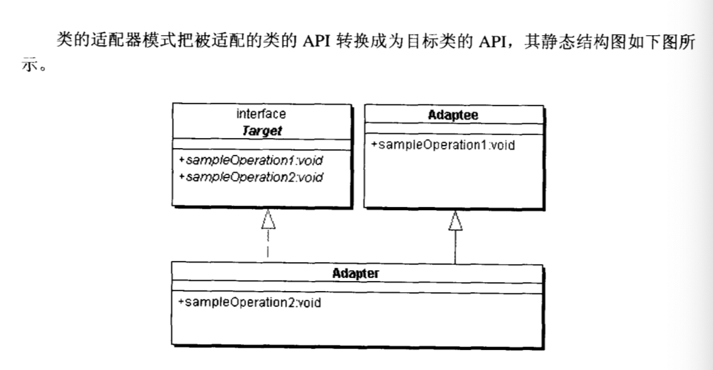
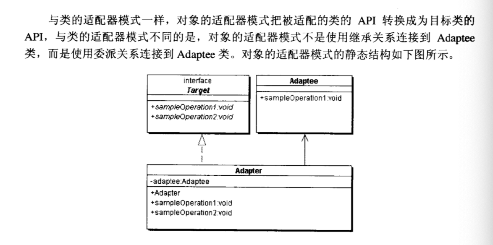

## Java设计模式
#### 适配器模式
##### 1. 定义
把一个类的接口变成客户端所期待的另外一种接口，从而使原本因接口不匹配无法在一起的工作两个类能够在一起工作。

##### 2. UML

##### 3. 模式特点
* 目标（Target）角色：这就是所期待的接口，目标可以是具体的或抽象类
* 源（Adaptee）角色：现有需要适配的接口
* 适配器角色（Adapter）角色：适配器类是本模式的核心/适配器把源接口转换成目标接口，显然，这一角色必须是具体类。

##### 4. 应用场景（在 Java 中的应用场景）

##### 5. 与其他模式的比较
* 适配器模式与装饰模式的区别

关注点不同，适配器模式主要是用于接口替换，而装饰模式关注的是通过动态组合来动态的为被装饰者注入新的功能或行为。

#### 合成模式
##### 1. 定义
##### 2. UML
##### 3. 模式特点
##### 4. 应用场景（在 Java 中的应用场景）
##### 5. 与其他模式的区别

#### 装饰模式
##### 1. 定义
##### 2. UML
##### 3. 模式特点
##### 4. 应用场景（在 Java 中的应用场景）
##### 5. 与其他模式的区别

#### 代理模式
##### 1. 定义
##### 2. UML
##### 3. 模式特点
##### 4. 应用场景（在 Java 中的应用场景）
##### 5. 与其他模式的区别

#### 享元模式
##### 1. 定义
##### 2. UML
##### 3. 模式特点
##### 4. 应用场景（在 Java 中的应用场景）
##### 5. 与其他模式的区别

#### 门面模式
##### 1. 定义
##### 2. UML
##### 3. 模式特点
##### 4. 应用场景（在 Java 中的应用场景）
##### 5. 与其他模式的区别